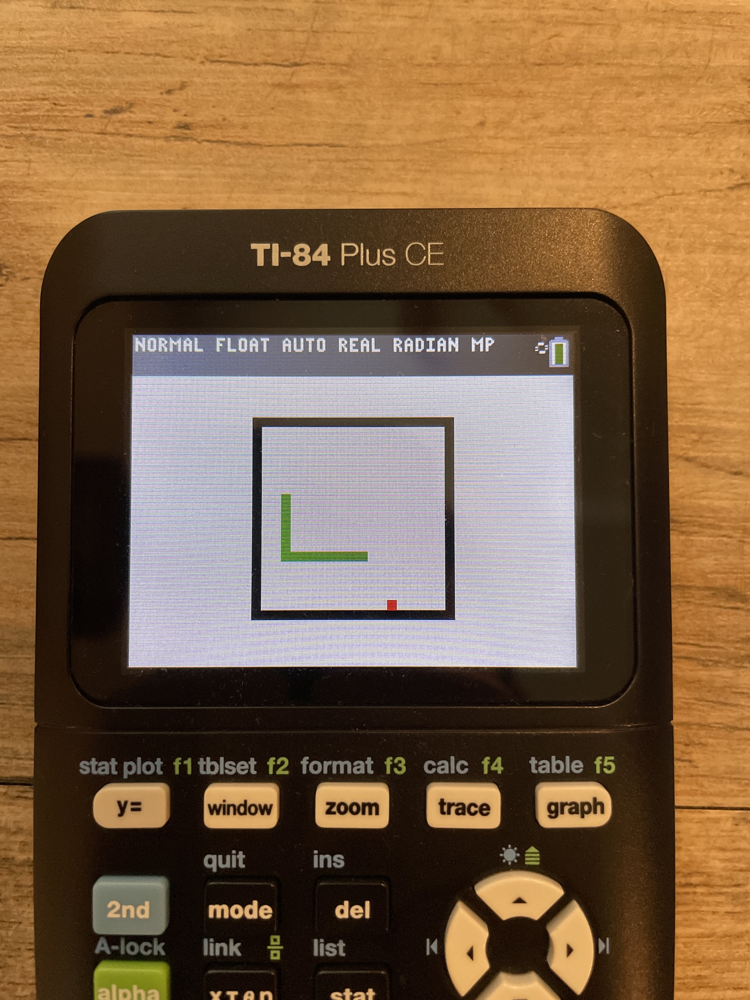

<h1>snake for ti 84 plus ce</h1>
a fansy snake game I coded on my calculator in ti basic coding language.
<h2>Features</h2>
<ul>
<li>fully working snake game</li>
<li>move with arrow keys</li>
<li>pause with "mode" key and unpause with "enter" key</li>
</ul>
<h2>screen shots</h2>

<h2>how to use</h2>
<ol>
<li>download snake</li>
<li>move with arrow keys</li>
<li>pause with "mode" key and unpause with "enter" key</li>
</ol>
